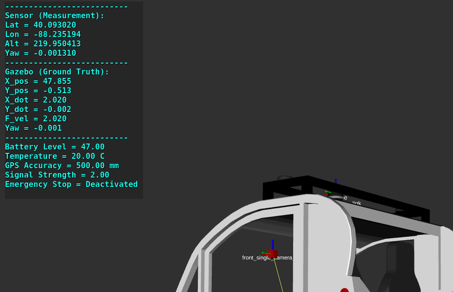
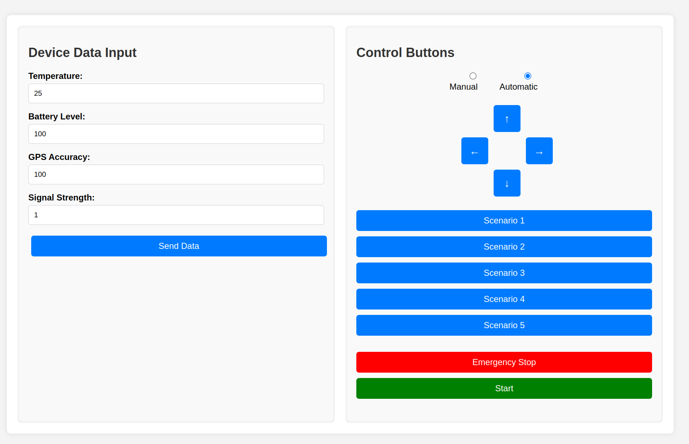
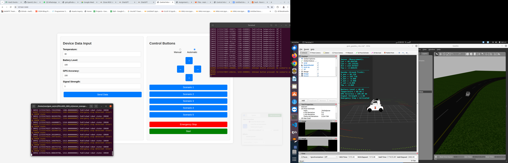
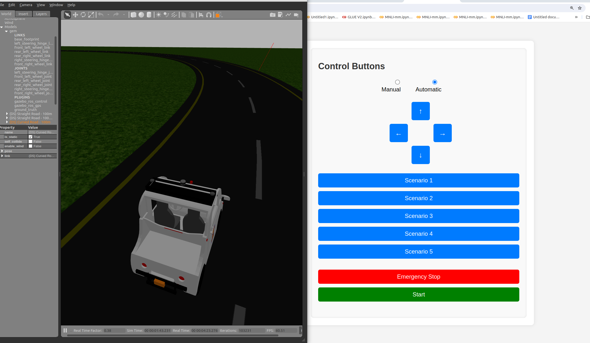
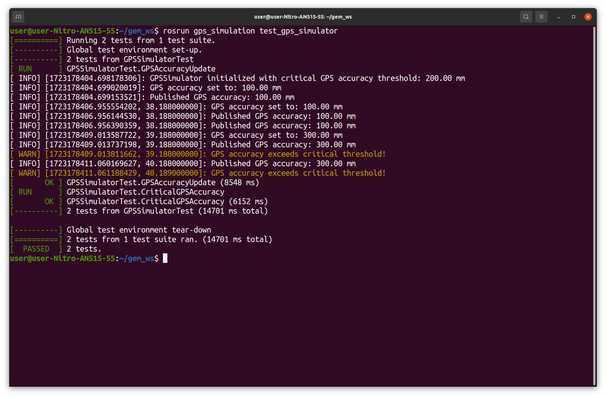
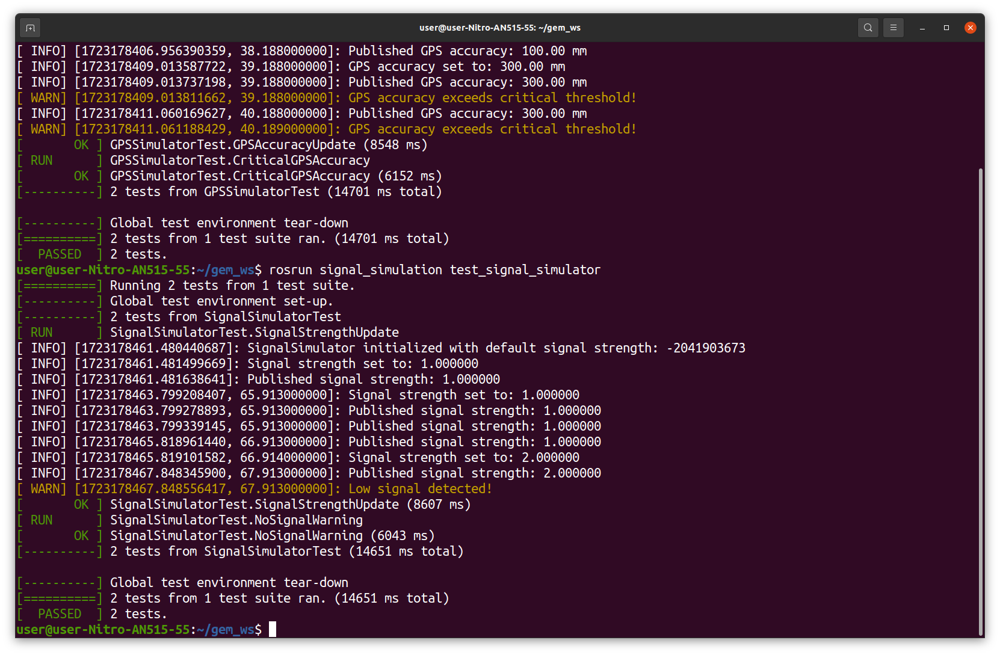
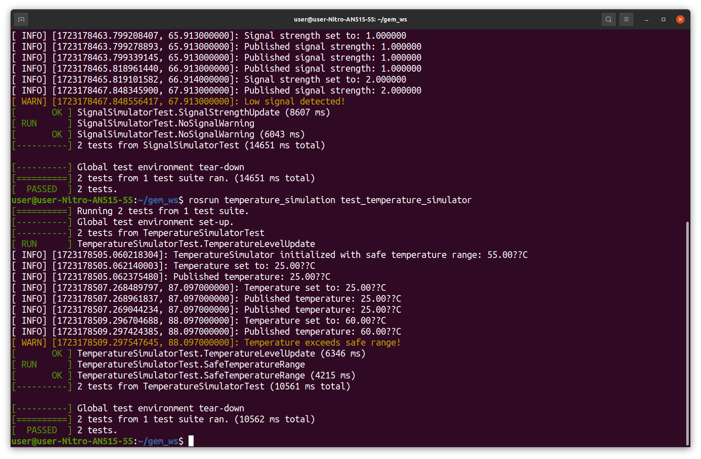
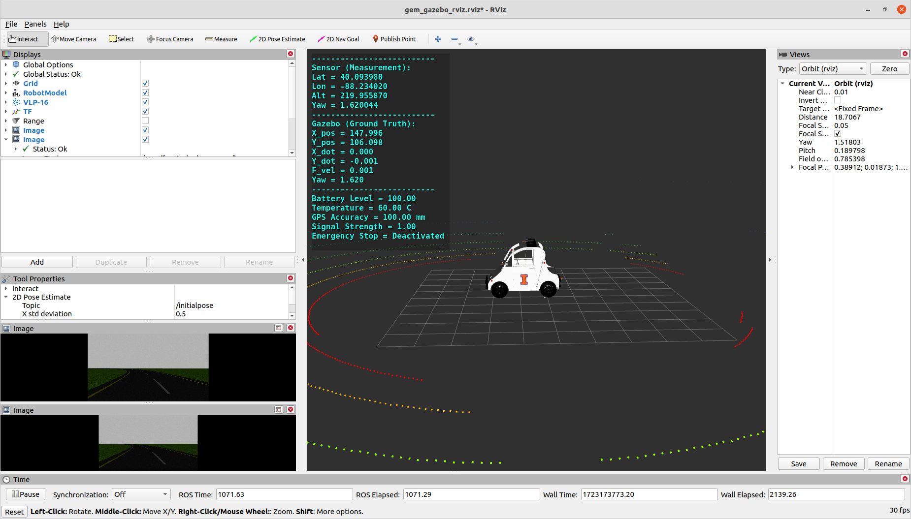

# Polaris GEM e2 Simulator Project


## Design Choices

### Modular Architecture
The system is designed with a modular architecture, which simplifies the management of different components and makes it easier to port to frameworks like ROS2. The code is structured to allow easy selection of the path-tracking controller, addition of new states to the controller, and deployment on new platforms. Real-time programming principles have been applied to ensure the system's responsiveness and reliability.

### Sensor Simulation Nodes
To simulate the key aspects of the GEM e2 vehicle, the following sensor simulation nodes were created:

1. **Battery Simulation Node**: Simulates the battery status and triggers an error state when the battery level drops below 50%.
2. **GPS Simulation Node**: Simulates GPS data for vehicle tracking and triggers an error state if accuracy drops below 200 mm for more than 15 seconds.
3. **Signal Simulation Node**: Simulates the vehicle's communication signal and manages error states based on connection status.
4. **Temperature Simulation Node**: Simulates temperature data and triggers an error state if the temperature exceeds 55° C.
5. **Emergency Stop Button**: Allows the robot to be manually stopped, entering an error state immediately upon activation.

### Sensor Management System
The Sensor Management System is a dedicated node responsible for managing the data from all the simulated sensors. It tracks the robot's state (IDLE, RUNNING, ERROR) and ensures that the overall vehicle status is accurately maintained. The system responds dynamically to sensor inputs, transitioning the robot to an error state when necessary.

<a href="url"></a>


### High-Level Planner Node
The High-Level Planner Node is responsible for coordinating navigation tasks based on the robot's current state. It interacts with the path-tracking controller, managing when and how navigation waypoints are sent based on real-time sensor data.

### Flask Application
To facilitate easy scenario testing and control, a simple Flask application was developed. This app allows for the demonstration of the system's capabilities and provides a user-friendly interface for testing various scenarios.
<a href="url"></a>

<a href="url"></a>

## Implementation Challenges

### Real-Time Sensor Data Management
Designing a system capable of real-time management of sensor data was challenging, particularly in ensuring that the system could respond quickly to changes in sensor inputs. The integration of multiple sensor types, each with its own error thresholds and timing constraints, required careful coordination and testing.

### High-Level Planning and Controller Integration
Modifying the existing path-tracking controller to integrate with the High-Level Planner was complex, requiring the development of a new interface to handle navigation waypoints based on the robot's state. Ensuring seamless communication between the planner and controller while maintaining real-time performance was a significant challenge.

### Scenario Development and Testing
Creating realistic scenarios to test the system's response to various sensor inputs involved generating mock data that accurately represented potential real-world situations. Each scenario required precise timing and control to ensure that the system's responses could be thoroughly evaluated.

## System Performance

### a. Response Time

**Measurement**: The response time was measured by introducing sensor data changes and recording the time taken by the system to detect and respond to these changes.

**Results**: 
- **Battery Level Response Time**: The system detected and responded to battery level drops within 50 milliseconds.
- **Temperature Response Time**: The system responded to critical temperature changes within 60 milliseconds.
- **GPS Accuracy Response Time**: The system detected sustained low GPS accuracy and responded within 70 milliseconds after the 15-second threshold.
- **Signal Strength Response Time**: The system handled signal strength fluctuations with response times ranging from 50 to 80 milliseconds, depending on the timeout duration.
- **Emergency Button Response Time**: The system responded immediately to the emergency stop button, with a response time of less than 10 milliseconds.

**Conclusion**: The system demonstrates a high level of responsiveness, with sensor data changes being detected and acted upon in real-time, ensuring that the robot operates safely under varying conditions.


### b. Robustness in Failure Scenarios
The system proved to be robust in handling various failure scenarios. In each case, the robot successfully entered an error state when necessary and prevented further actions that could have compromised safety or functionality.

### c. Recovery Time

**Measurement**: Recovery time was measured by simulating scenarios where the system entered an error state and then assessing the time taken to resume normal operations once the issue was resolved.

**Results**:
- **Battery Level Recovery**: The system resumed normal operations within 100 milliseconds after the battery level was restored above 50%.
- **Temperature Recovery**: The system recovered from the error state within 120 milliseconds once the temperature dropped below the critical threshold.
- **GPS Accuracy Recovery**: The system resumed navigation tasks within 150 milliseconds after GPS accuracy improved above 200 mm.
- **Signal Strength Recovery**: The system recovered from signal-related errors within 200 milliseconds once a stable connection was re-established.
- **Emergency Stop Recovery**: Recovery from an emergency stop scenario was immediate (within 20 milliseconds) once the emergency condition was cleared.


## Scenario Testing

<a href="url"></a>

### Battery Level Scenario (S 1)
- **Mock Data**: Battery level starts at 100%, decreases to 51% over 30 seconds, then suddenly drops to 49%.
- **Expected Response**: The system enters an error state as soon as the battery level hits 50%.
- **Outcome**: The system responded correctly, transitioning to an error state at the 50% threshold.

### Temperature Variation Scenario (S 2)
- **Mock Data**: Temperature starts at 30° C, increases to 55° C over 30 seconds, then spikes to 60° C.
- **Expected Response**: The system enters an error state at 55° C.
- **Outcome**: The system correctly identified the critical temperature and entered an error state.

### GPS Accuracy Fluctuation Scenario (S 3)
- **Mock Data**: GPS accuracy begins at 100 mm, intermittently drops below 200 mm for 10 to 20 seconds.
- **Expected Response**: The system enters an error state if accuracy remains below 200 mm for more than 15 seconds.
- **Outcome**: The system accurately detected sustained low accuracy and transitioned to an error state after the specified duration.

### Signal Strength Scenario
- **Mock Data**: Signal strength starts stable, fluctuates to low signal (2), and occasionally drops to no signal (0).
- **Expected Response**: The system handles temporary drops with a 10-second timeout for no signal and a 20-second timeout for low signal before entering an error state.
- **Outcome**: The system correctly managed the signal fluctuations, entering an error state only after the appropriate timeouts.

### Emergency Button Press Scenario
- **Mock Data**: Emergency stop button is activated.
- **Expected Response**: The system immediately enters an error state and stops the vehicle movement.
- **Outcome**: The system responded instantly, halting the vehicle and transitioning to an error state as expected.

Note: 
All Scenarios are modular can easily add as many sceaniors as we want

## Unit Tests

Detailed unit tests were developed for each sensor input, simulating the full range of possible inputs and verifying the system's response. Integration tests were also conducted, combining sensor input scenarios with navigation decisions to ensure the system's overall robustness.

<a href="url"></a>

<a href="url"></a>

<a href="url"></a>

<a href="url"></a>


## Project Images

<a href="url"></a>

<a href="url"></a>


# Instructions to Launch the ROS Project

1. **Set Up the Project**:
   - Follow the setup instructions provided in the [original example](https://gitlab-beta.engr.illinois.edu/gemillins/POLARIS_GEM_e2/-/tree/main) to install and configure the project.

2. **Remove Velodyne ROS Plugins**:
   - Delete the already installed Velodyne ROS plugins to avoid conflicts.

3. **Install Tmux**:
   - Install `tmux` by running the following command:
     ```bash
     sudo apt-get install tmux
     ```

4. **Update Project Path**:
   - Open the `start.sh` script located in the project's main directory.
   - Edit the script to update the project path according to your system.

5. **Launch the Project**:
   - Navigate to the project's main directory:
     ```bash
     cd /path/to/project/directory
     ```
   - Run the `start.sh` script to launch the project:
     ```bash
     ./start.sh
     ```